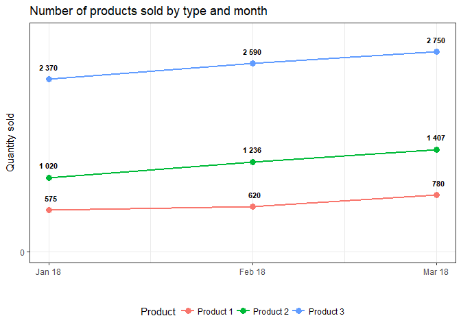
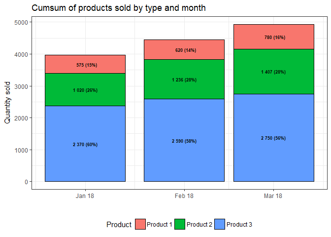
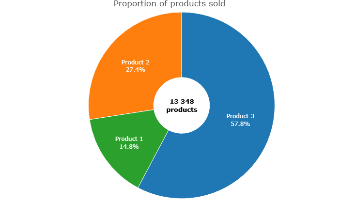
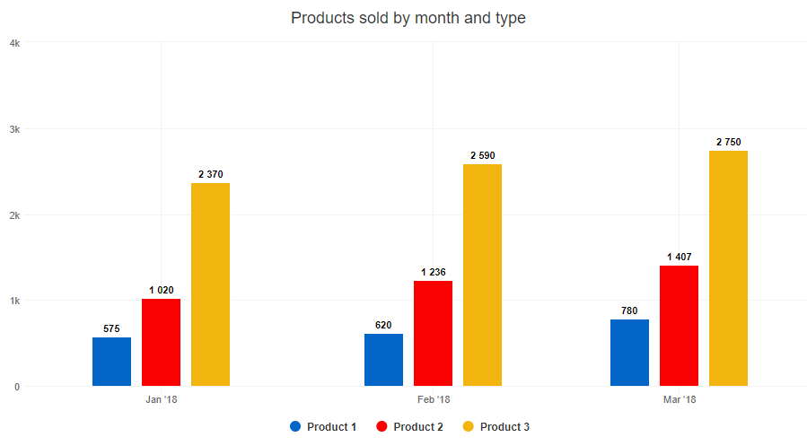
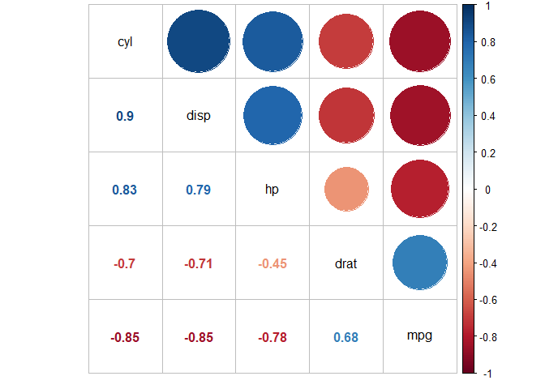
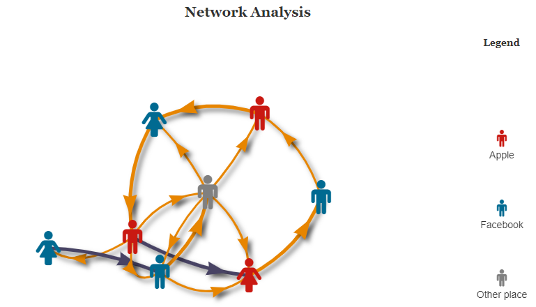
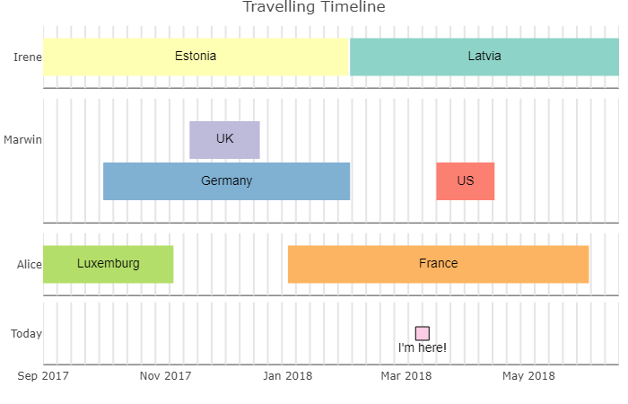
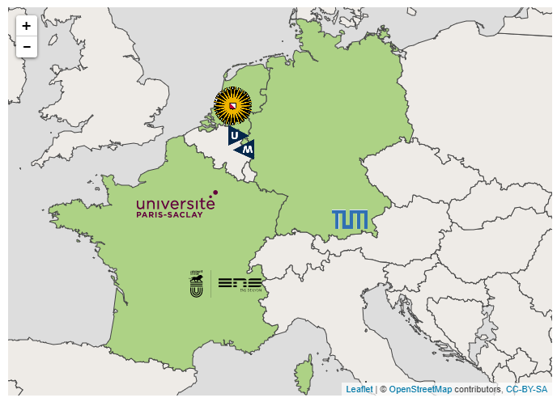
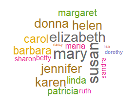

# Visualisation Tools in R
Elvira Nassirova  
9 mars 2018  

To interact with the graphs see the [Visualisation_Tools_in_R.html](https://github.com/bjolko/r_visualisation_tools/blob/master/Visualisation_Tools_in_R.html) file.

## ggplot2

Show quickly sales dynamics information:


```r
library(dplyr)
library(ggplot2)
library(lubridate)

df <- data.frame(sdate = rep(dmy(01012018, 01022018, 01032018), 3),
                 sales = c(575, 620, 780, 1020, 1236, 1407, 2370, 2590, 2750),
                 product = c(rep('Product 1', 3), rep('Product 2', 3), 
                             rep('Product 3', 3))) %>% 
      mutate(sales_f = format(sales, big.mark = ' ')) %>% 
      group_by(sdate) %>% 
      mutate(pct = scales::percent(round(sales/sum(sales), 2)))

ggplot(df, aes(sdate, sales, col = product, group = product)) +
  geom_point(size = 3)+
  geom_line(size = 1)+
  geom_text(aes(label = sales_f), size=3, vjust = -1.5, col='black', 
            fontface="bold", show.legend = FALSE)+
  scale_x_date(name="", date_breaks = "1 month", date_labels = "%b %y")+
  scale_y_continuous(name="Quantity sold", 
                     limits = c(0, 3000), breaks = seq(0, 1500, 3000))+
  scale_color_discrete('Product')+
  ggtitle('Number of products sold by type and month')+
  theme_bw()+
  theme(legend.position = 'bottom')
```

<!-- -->


```r
ggplot(df, aes(sdate, sales, fill = product)) +
  geom_bar(stat="identity", position = "stack", col='black')+
  scale_x_date(name="", date_breaks = "1 month", date_labels = "%b %y")+
  scale_y_continuous(name = "Quantity sold")+
  geom_text(aes(label = paste0(sales_f, ' (', pct, ')')), size = 2.5, fontface="bold", 
            position = position_stack(vjust = 0.5))+
  scale_fill_discrete('Product')+
  ggtitle('Cumsum of products sold by type and month')+
  theme_bw()+
  theme(legend.position = 'bottom')
```

<!-- -->

## plotly

Show each product share in total sales:


```r
library(plotly)

df %>% group_by(product) %>% 
  summarise(n = sum(sales)) %>% 
  plot_ly(labels = ~product, values = ~n, 
          textposition = 'inside',
          textinfo = 'label+percent',
          insidetextfont = list(color = '#FFFFFF'),
          hoverinfo = 'text',
          text = ~paste(paste0(round(n/1000), 'K'), 'of', product, 'were sold'),
          marker = list(line = list(color = '#FFFFFF', width = 1))) %>%
  add_pie(hole = 0.3) %>%
  layout(title = "Proportion of products sold",  showlegend = F,
         xaxis = list(showgrid = FALSE, zeroline = FALSE, showticklabels = FALSE),
         yaxis = list(showgrid = FALSE, zeroline = FALSE, showticklabels = FALSE)) %>% 
  add_annotations(text = paste0('<b>', format(sum(df$sales), big.mark = ' '), 
                                '\n products </b>'), 
                  showarrow = F, font = list(color = 'black', size = 13))
```

<!-- -->

## highcharter

Another way to show dynamics but interactively:


```r
library(highcharter)

hchart(df, "column", hcaes(x = sdate, y = sales, group = product), 
       dataLabels = list(align = "center", enabled = TRUE, 
                         format = '{point.sales_f}'), 
       tooltip = list(pointFormat = "<b>{point.product}</b> was sold <b>{point.sales_f}</b> times")) %>%
  hc_title(text = 'Products sold by month and type', fontWeight = "bold") %>% 
  hc_yAxis(title=list(text=''), max = 4000) %>% 
  hc_xAxis(title=list(text='')) %>% 
  hc_add_theme(hc_theme_google()) 
```

<!-- -->

## corrplot

That's how you can visualise correlation matrix:


```r
library(corrplot)

c <- cor(mtcars[1:5])

ctest <- cor.mtest(mtcars[1:5], conf.level = .95)

corrplot.mixed(c, tl.col = "black", order = "FPC")
```

<!-- -->

## visNetwork

Amazing tool to perform Network Analysis:


```r
library(visNetwork)

set.seed(12)
nodes <- 
  data.frame(id = 1:8, sex = sample(c('M', 'F'), 8, replace = TRUE),
             work = sample(c('Apple', 'Facebook', 'Other place'), 8, replace = TRUE)) %>% 
  mutate(shape = 'icon',
         icon.code = ifelse(sex == 'M', 'f183', 'f182'), 
         icon.size = 50, 
         icon.color = ifelse(work == 'Apple', '#c91912', 
                      ifelse(work == 'Facebook', '#006a91', 'grey')),
         title = paste0(ifelse(sex == 'M', 'He', 'She'), 
                        ' works in <b>', work, '</b> '))

set.seed(12)
links <- 
  data.frame(from = sample(1:8, 20, replace = T),
             to = sample(1:8, 20, replace = T)) %>% 
  distinct() %>% filter(from!=to) %>% 
  mutate(sum = sample(1000:3000, nrow(.))) %>% 
  merge(select(nodes, id, work) %>% dplyr::rename(from_work = work), 
        by.x = 'from', by.y = 'id') %>% 
  merge(select(nodes, id, work) %>% dplyr::rename(to_work = work), 
        by.x = 'to', by.y = 'id') %>% 
  mutate(collegues = ifelse(from_work == to_work, 1, 0),
         color = ifelse(collegues == 1, '#484364', 'e78500'),
         width = ifelse(sum < 2000, 3, 5)) %>% 
  select(-from_work, -to_work)
  
workcolors <- data.frame(work = unique(nodes$work), 
                         clr = c('#c91912', '#006a91', 'grey'))

visNetwork(nodes = nodes, edges = links, main = "Network Analysis", width = '100%') %>% 
  addFontAwesome() %>% 
  visEdges(shadow = TRUE,
           arrows =list(to = list(enabled = T, scaleFactor = 1))) %>%
  visLayout(randomSeed = 12) %>% 
  #visOptions(selectedBy = "work") %>% 
  visLegend(addNodes = list(
    list(label = workcolors$work[1], shape = "icon", 
         icon = list(code = "f183", size = 25, color = workcolors$clr[1])),
    list(label = workcolors$work[2], shape = "icon", 
         icon = list(code = "f183", size = 25, color = workcolors$clr[2])),
    list(label = workcolors$work[3], shape = "icon", 
         icon = list(code = "f183", size = 25, color = workcolors$clr[3]))),
    main = 'Legend', position = 'right',
    useGroups = FALSE)
```

<!-- -->

## vistime

Let's look where our friends will be this year:


```r
library(vistime)
library(readxl)

timedata <- read_xlsx('timeline.xlsx', sheet = 1) %>% 
  mutate_at(c('start', 'end'), funs(if_else(group == 'Today', Sys.Date(), as.Date(.))))

vistime(timedata, title = 'Travelling Timeline')
```

<!-- -->

## leaflet

Locations of some universities in Europe:


```r
library(leaflet)
library(htmltools)
library(rgdal)

unis <- 
  data.frame(university = c('Université Paris-Sud', 'ENS de Lyon', 'Maastricht University', 'Utrecht University', 'TUM'),
             lat = c(48.701414, 45.733134, 50.850242, 52.085033, 48.147728),
             long = c(2.179794, 4.833982, 5.685420, 5.170424, 11.562748),
             country = c('France', 'France', 'Netherlands', 'Netherlands', 'Germany'))

icons <-  icons(
  iconUrl = c('https://www.universite-paris-saclay.fr/profiles/saclay/themes/saclay_v2/logo.svg', 
              'http://www.ens-lyon.fr/themes/custom/ens_theme/logo.svg', 
              'https://www.maastrichtuniversity.nl/sites/all/themes/unimaas/static/images/icons/favicon-192x192.png', 
              'https://upload.wikimedia.org/wikipedia/en/thumb/2/26/Utrecht_University_logo.svg/1200px-Utrecht_University_logo.svg.png', 
              'https://www.tum.de/favicon.png'),
  iconWidth = c(100, 100, 50, 50, 50), iconHeight = c(100, 100, 50, 50, 50))

states <- readOGR("all countries/ne_10m_admin_0_countries.shp",
                  GDAL1_integer64_policy = TRUE, verbose = FALSE) %>% 
          subset(REGION_UN == 'Europe')

states$color <- ifelse(states$NAME %in% c('France', 'Netherlands', 'Germany'), '#add285', '#eeebe7')


leaflet() %>%
  setView(lng = 7.785313, lat = 48.777725, zoom = 5) %>% #start point
  addPolygons(data = states, color = "#444444", weight = 1, smoothFactor = 0.7,
              opacity = 1.0, fillOpacity = 1,
              fillColor = ~htmlEscape(color),
              highlightOptions = highlightOptions(color = "white", weight = 2,
                                                  bringToFront = F),
              label = ~htmlEscape(NAME)) %>% 
  addTiles() %>%  # Add default OpenStreetMap map tiles
  addMarkers(data = unis, ~long, ~lat, popup = ~htmlEscape(university), icon = icons) 
```

<!-- -->

## wordcloud

Which name is more frequent?


```r
library(wordcloud)

df <- data.frame(name = lexicon::common_names[1:20],
                 freq = sample(1:10, 20, replace = TRUE))

set.seed(12)
wordcloud(df$name, df$freq, min.freq = 1, scale = c(2,.1),
          max.words = 20, random.order = FALSE, rot.per = 0.2, 
          colors = brewer.pal(8, "Dark2"))
```

<!-- -->

## Useful Links

1. [An Introduction to corrplot Package](https://cran.r-project.org/web/packages/corrplot/vignettes/corrplot-intro.html)

2. [Highcharter](http://jkunst.com/highcharter/index.html)

3. [vistime](https://github.com/shosaco/vistime)

4. [timevis](https://daattali.com/shiny/timevis-demo/)

5. [Leaflet for R](https://rstudio.github.io/leaflet/)

6. [Color Palettes](http://colorpalettes.net/)
